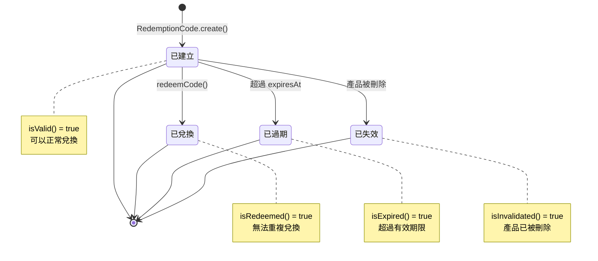
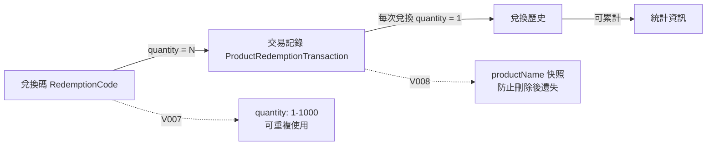

# 兌換模組設計與實作

本文件說明 LTDJMS Discord Bot 的兌換模組，負責兌換碼的生成、驗證與兌換流程，並與產品模組整合以實現自動獎勵發放。

## 1. 概述

兌換模組提供完整的兌換碼管理系統，允許管理員為產品生成唯一兌換碼，使用者輸入代碼即可兌換並獲得對應獎勵。系統支援到期時間設定、可重複使用兌換碼，並記錄完整的兌換歷史。

主要功能：
- 兌換碼生成與管理
- 代碼驗證與兌換
- 可重複使用兌換碼（V007 新增 `quantity` 欄位）
- 到期時間支援
- 自動獎勵發放
- 完整兌換歷史追蹤（V008 新增 `product_redemption_transaction`）
- 產品刪除時自動失效關聯的兌換碼
- 即時面板更新（V008 新增 `ProductRedemptionCompletedEvent`）

## 2. 領域模型

### 2.1 RedemptionCode

兌換碼實體，代表可兌換的代碼。

```java
// src/main/java/ltdjms/discord/redemption/domain/RedemptionCode.java
public record RedemptionCode(
    Long id,
    String code,
    Long productId,        // 對應產品 ID（可為 NULL，當產品被刪除時）
    long guildId,
    int quantity,          // V007 新增：可兌換次數，預設為 1
    Instant expiresAt,
    Long redeemedBy,
    Instant redeemedAt,
    Instant createdAt,
    Instant invalidatedAt  // 失效時間（若關聯產品被刪除）
) {
    public static final int CODE_LENGTH = 16;
    public static final String CODE_CHARACTERS = "ABCDEFGHJKMNPQRSTUVWXYZ23456789";
    public static final int MIN_QUANTITY = 1;
    public static final int MAX_QUANTITY = 1000;

    // 商業規則驗證
    public RedemptionCode {
        Objects.requireNonNull(code, "code must not be null");
        if (code.isBlank()) {
            throw new IllegalArgumentException("code must not be blank");
        }
        if (code.length() > 32) {
            throw new IllegalArgumentException("code must not exceed 32 characters");
        }
        // V007 新增：quantity 驗證
        if (quantity < MIN_QUANTITY) {
            throw new IllegalArgumentException(
                "quantity must be at least " + MIN_QUANTITY);
        }
        if (quantity > MAX_QUANTITY) {
            throw new IllegalArgumentException(
                "quantity must not exceed " + MAX_QUANTITY);
        }
        // 確保 redeemed_by 和 redeemed_at 一致
        if ((redeemedBy == null) != (redeemedAt == null)) {
            throw new IllegalArgumentException(
                "redeemedBy and redeemedAt must both be specified or both be null");
        }
    }

    /**
     * 檢查是否已被兌換
     */
    public boolean isRedeemed() {
        return redeemedBy != null;
    }

    /**
     * V007 新增：檢查是否仍可兌換（基於 quantity）
     * 注意：此方法只在單次兌換模式下有效，多次兌換需搭配交易記錄判斷
     */
    public boolean hasRemainingUses() {
        return !isRedeemed();
    }

    /**
     * 檢查是否已過期
     */
    public boolean isExpired() {
        return expiresAt != null && Instant.now().isAfter(expiresAt);
    }

    /**
     * 檢查是否已被失效
     * 當關聯產品被刪除時，兌換碼會被標記為失效
     */
    public boolean isInvalidated() {
        return invalidatedAt != null;
    }

    /**
     * 檢查是否可用
     * 必須同時滿足：未失效、未兌換、未過期
     */
    public boolean isValid() {
        return !isInvalidated() && !isRedeemed() && !isExpired();
    }

    /**
     * 建立已兌換的副本
     */
    public RedemptionCode withRedeemed(long userId) {
        if (isRedeemed()) {
            throw new IllegalStateException("Code has already been redeemed");
        }
        return new RedemptionCode(
            this.id, this.code, this.productId, this.guildId,
            this.expiresAt, userId, Instant.now(), this.createdAt, this.invalidatedAt
        );
    }

    /**
     * 建立已失效的副本
     */
    public RedemptionCode withInvalidated() {
        if (isInvalidated()) {
            throw new IllegalStateException("Code has already been invalidated");
        }
        return new RedemptionCode(
            this.id, this.code, null, this.guildId,
            this.expiresAt, this.redeemedBy, this.redeemedAt,
            this.createdAt, Instant.now()
        );
    }

    /**
     * 取得遮蔽後的代碼用於顯示
     * 只顯示前 4 字和後 4 字
     */
    public String getMaskedCode() {
        if (code.length() <= 8) {
            return code;
        }
        return code.substring(0, 4) + "****" + code.substring(code.length() - 4);
    }
}
```

關鍵商業規則：
- 代碼唯一性
- 兌換狀態一致性（若已兌換，必須有兌換時間）
- 到期檢查
- 失效檢查（當關聯產品被刪除時）

### 2.2 兌換碼狀態機

兌換碼有以下狀態，由領域模型的方法判斷：



### 2.3 RedemptionCodeGenerator

負責生成唯一兌換碼。

```java
// src/main/java/ltdjms/discord/redemption/services/RedemptionCodeGenerator.java
public class RedemptionCodeGenerator {
    private static final String CHARACTERS = "ABCDEFGHJKMNPQRSTUVWXYZ23456789";
    private static final int CODE_LENGTH = 16;

    /**
     * 生成隨機兌換碼
     * 排除易混淆字元: 0/O, 1/I/L
     */
    public String generate() {
        SecureRandom random = new SecureRandom();
        StringBuilder code = new StringBuilder(CODE_LENGTH);
        for (int i = 0; i < CODE_LENGTH; i++) {
            code.append(CHARACTERS.charAt(random.nextInt(CHARACTERS.length())));
        }
        return code.toString();
    }
}
```

**生成規則**：
- 長度：16 字元
- 字元集：`ABCDEFGHJKMNPQRSTUVWXYZ23456789`（排除易混淆字元 0/O、1/I/L）
- 生成時會檢查資料庫確保唯一性，最多重試 10 次

### 2.4 ProductRedemptionTransaction（V008 新增）

商品兌換交易紀錄，記錄每次兌換的完整資訊。

```java
// src/main/java/ltdjms/discord/redemption/domain/ProductRedemptionTransaction.java
public record ProductRedemptionTransaction(
    Long id,
    long guildId,
    long userId,
    long productId,
    String productName,      // 產品名稱快照（防止產品刪除後無法顯示）
    String redemptionCode,   // 使用的兌換碼
    int quantity,            // V007 新增：兌換的數量
    RewardType rewardType,   // 獎勵類型（CURRENCY 或 TOKEN，無自動獎勵為 null）
    Long rewardAmount,       // 獎勵總額（quantity × 產品單位獎勵數量）
    Instant createdAt
) {
    public enum RewardType {
        CURRENCY("貨幣"),
        TOKEN("代幣");

        private final String displayName;

        RewardType(String displayName) {
            this.displayName = displayName;
        }

        public String getDisplayName() {
            return displayName;
        }
    }

    // 商業規則驗證
    public ProductRedemptionTransaction {
        Objects.requireNonNull(productName, "productName must not be null");
        if (productName.isBlank() || productName.length() > 100) {
            throw new IllegalArgumentException("productName must be 1-100 characters");
        }
        Objects.requireNonNull(redemptionCode, "redemptionCode must not be null");
        if (quantity <= 0 || quantity > 1000) {
            throw new IllegalArgumentException("quantity must be 1-1000");
        }
        // 獎勵類型和金額的一致性檢查
        if ((rewardType != null) != (rewardAmount != null)) {
            throw new IllegalArgumentException(
                "rewardType and rewardAmount must both be specified or both be null");
        }
    }

    /**
     * 檢查是否有自動獎勵
     */
    public boolean hasReward() {
        return rewardType != null && rewardAmount != null;
    }

    /**
     * 格式化顯示字串
     */
    public String formatForDisplay() {
        StringBuilder sb = new StringBuilder();
        sb.append("**").append(productName).append("**");
        if (quantity > 1) {
            sb.append(" x").append(quantity);
        }
        if (hasReward()) {
            sb.append(" | ").append(rewardType.getDisplayName())
                .append(" +").append(String.format("%,d", rewardAmount));
        } else {
            sb.append(" | 無自動獎勵");
        }
        sb.append(" | `").append(getMaskedCode()).append("`");
        return sb.toString();
    }

    /**
     * 取得遮蔽後的兌換碼（前 4 碼 + 後 4 碼）
     */
    public String getMaskedCode() {
        if (redemptionCode.length() <= 8) {
            return redemptionCode;
        }
        return redemptionCode.substring(0, 4) + "****"
            + redemptionCode.substring(redemptionCode.length() - 4);
    }
}
```

關鍵設計：
- **產品名稱快照**：即使產品被刪除，交易記錄仍可顯示產品資訊
- **遮蔽代碼**：顯示時只顯示前後 4 碼，保護代碼隱私
- **完整性驗證**：quantity、rewardType、rewardAmount 的商業規則驗證

### 2.5 商品兌換數量與交易記錄關係



**V007/V008 整合流程**：
1. 管理員生成兌換碼時指定 `quantity`（預設 1）
2. 使用者兌換時，系統建立 `ProductRedemptionTransaction` 記錄
3. 交易記錄保存產品名稱快照，確保歷史可追溯
4. 系統發布 `ProductRedemptionCompletedEvent` 觸發面板更新

## 3. 服務層

### 3.1 RedemptionService

負責兌換碼生成、驗證、原子兌換與事件發布，並將商品獎勵發放委派給 `ProductRewardService`。

核心相依元件：

- `RedemptionCodeRepository`: 兌換碼的查詢、批次建立、原子兌換與回滾
- `ProductRepository`: 載入商品資料
- `RedemptionCodeGenerator`: 產生候選兌換碼字串
- `ProductRewardService`: 統一處理貨幣 / 代幣獎勵發放與交易紀錄
- `ProductRedemptionTransactionService`: 記錄商品兌換交易
- `DomainEventPublisher`: 發布 `RedemptionCodesGeneratedEvent` 與 `ProductRedemptionCompletedEvent`

主要流程如下：

**generateCodes(...)**
- 驗證 `count` 範圍為 `1..100`
- 驗證 `quantity` 範圍為 `1..1000`
- 驗證到期時間不可早於目前時間
- 載入商品後批次產生唯一兌換碼
- 呼叫 `saveAll(...)` 持久化，並發布 `RedemptionCodesGeneratedEvent`

**redeemCode(...)**
1. 正規化輸入（trim + uppercase）
2. 驗證代碼存在、屬於當前 guild、未失效、未兌換、未過期
3. 驗證關聯商品仍存在
4. 若商品有自動獎勵，先以 `Math.multiplyExact(product.rewardAmount(), code.quantity())` 預先計算總獎勵
5. 呼叫 `markAsRedeemedIfAvailable(...)` 原子標記兌換碼，避免併發重複兌換
6. 委派 `ProductRewardService.grantReward(...)` 發放總獎勵，描述訊息會攜帶遮罩後兌換碼與 `xN` 數量
7. 若獎勵發放失敗，呼叫 `clearRedeemedIfMatches(...)` 將兌換碼恢復為可用狀態
8. 記錄 `ProductRedemptionTransaction` 並發布 `ProductRedemptionCompletedEvent`
9. 回傳 `RedemptionResult`

`RedemptionResult.formatSuccessMessage()` 會根據實際總獎勵金額，格式化貨幣或代幣獎勵訊息。

主要方法：
- `generateCodes`: 為產品生成多個兌換碼（最多 100 個）
- `redeemCode`: 驗證並原子兌換代碼，必要時回滾兌換狀態
- `findByCode`: 查詢單一代碼
- `getCodePage`: 取得分頁代碼列表
- `getCodeStats`: 取得代碼統計資訊

### 3.2 ProductRedemptionTransactionService（V008 新增）

負責商品兌換交易記錄的業務邏輯。

```java
// src/main/java/ltdjms/discord/redemption/services/ProductRedemptionTransactionService.java
public class ProductRedemptionTransactionService {
    private final ProductRedemptionTransactionRepository transactionRepository;
    private final DomainEventPublisher eventPublisher;

    /**
     * 記錄商品兌換交易
     */
    public Result<ProductRedemptionTransaction, DomainError> recordTransaction(
        long guildId,
        long userId,
        long productId,
        String productName,
        String redemptionCode,
        int quantity,
        ProductRedemptionTransaction.RewardType rewardType,
        Long rewardAmount
    ) {
        var transaction = ProductRedemptionTransaction.create(
            guildId, userId, productId, productName, redemptionCode,
            quantity, rewardType, rewardAmount
        );

        var saved = transactionRepository.save(transaction);

        // 發布事件以觸發面板即時更新
        eventPublisher.publish(new ProductRedemptionCompletedEvent(
            guildId, userId, saved, Instant.now()
        ));

        return Result.ok(saved);
    }

    /**
     * 取得使用者的商品兌換歷史
     */
    public Result<List<ProductRedemptionTransaction>, DomainError> getUserTransactions(
        long guildId, long userId, int limit, int offset
    ) {
        return transactionRepository.findByGuildAndUser(
            guildId, userId, limit, offset
        );
    }

    /**
     * 取得使用者的商品兌換總數
     */
    public Result<Long, DomainError> getUserTransactionCount(
        long guildId, long userId
    ) {
        return transactionRepository.countByGuildAndUser(guildId, userId);
    }
}
```

主要功能：
- **記錄交易**：每次兌換成功後建立交易記錄
- **查詢歷史**：支援分頁查詢使用者的兌換歷史
- **事件發布**：建立交易記錄後發布 `ProductRedemptionCompletedEvent`
- **統計數量**：取得使用者的總兌換次數

**兌換碼驗證與兌換流程**：

1. 代碼格式驗證（非空、去除空白、轉大寫）
2. 查詢代碼是否存在
3. 檢查是否屬於當前伺服器
4. 檢查是否已失效（`isInvalidated()`）
5. 檢查是否已兌換（`isRedeemed()`）
6. 檢查是否已過期（`isExpired()`）
7. 檢查關聯產品是否存在（`productId` 不可為 `NULL`）
8. 若商品有獎勵，先計算 `rewardAmount × quantity`，並攔截溢位
9. 以 `markAsRedeemedIfAvailable(...)` 原子標記兌換碼
10. 發放獎勵；失敗時以 `clearRedeemedIfMatches(...)` 回滾
11. 建立兌換交易與發布完成事件

## 4. 持久層

### 4.1 RedemptionCodeRepository

兌換碼資料存取介面。介面回傳值以 plain object / primitive 為主，服務層負責將 persistence 例外轉成 `DomainError`。

```java
// src/main/java/ltdjms/discord/redemption/domain/RedemptionCodeRepository.java
public interface RedemptionCodeRepository {
    RedemptionCode save(RedemptionCode code);
    List<RedemptionCode> saveAll(List<RedemptionCode> codes);
    RedemptionCode update(RedemptionCode code);

    boolean markAsRedeemedIfAvailable(long codeId, long userId, Instant redeemedAt);
    boolean clearRedeemedIfMatches(long codeId, long userId, Instant redeemedAt);

    Optional<RedemptionCode> findByCode(String code);
    Optional<RedemptionCode> findById(long id);
    boolean existsByCode(String code);

    List<RedemptionCode> findByProductId(long productId, int limit, int offset);
    long countByProductId(long productId);
    long countRedeemedByProductId(long productId);
    long countUnusedByProductId(long productId);
    int deleteUnusedByProductId(long productId);

    CodeStats getStatsByProductId(long productId);
    int invalidateByProductId(long productId);
    List<RedemptionCode> findInvalidatedByProductId(long productId);
}
```

其中兩個與本次版本最相關的介面為：
- `markAsRedeemedIfAvailable(...)`: 只在兌換碼仍可用時才原子標記為已兌換
- `clearRedeemedIfMatches(...)`: 在下游獎勵發放失敗時，依照同一組 `codeId + userId + redeemedAt` 回滾

### 4.2 JdbcRedemptionCodeRepository

JDBC 實作除了基本 CRUD 與查詢外，也負責這兩個條件式更新：

- `markAsRedeemedIfAvailable(...)`
  - SQL `WHERE` 同時檢查 `redeemed_by IS NULL`、`invalidated_at IS NULL`、`product_id IS NOT NULL`
  - 並限制 `expires_at` 為未過期或 `NULL`
  - 成功更新 1 筆才代表搶佔成功
- `clearRedeemedIfMatches(...)`
  - 只會清除與本次兌換相同的 `redeemed_by` / `redeemed_at`
  - 避免回滾其他請求已合法完成的狀態

`CodeStats` 目前提供：
- `totalCount`
- `redeemedCount`
- `unusedCount`
- `expiredCount`

## 5. 整合方式

### 5.1 與管理面板整合

兌換碼管理透過管理面板進行：

- 查看產品的代碼統計（總數、未使用、已兌換、已過期、已失效）
- 生成新代碼（支援指定數量和到期時間）
- 查看兌換歷史（分頁顯示）

```java
// AdminPanelService 中
public CodeStats getRedemptionCodeStats(long productId) {
    return redemptionService.getCodeStats(productId);
}
```

### 5.2 與產品模組整合

兌換系統依賴產品定義：

- 代碼生成時參考產品（記錄 `productId` 和 `guildId`）
- 兌換時取得獎勵資訊（依 `RewardType` 發放貨幣或代幣）
- **產品刪除時會失效所有關聯的兌換碼**（透過 `invalidateByProductId`）

### 5.3 產品刪除對兌換碼的影響

當產品被刪除時：

1. `ProductService.deleteProduct()` 會先呼叫 `RedemptionCodeRepository.invalidateByProductId()`
2. 所有關聯的兌換碼會被標記為失效（`invalidated_at` 設為當前時間）
3. 產品刪除後，由於外鍵約束 `ON DELETE SET NULL`，`redemption_code.product_id` 會自動設為 `NULL`
4. 這些已失效的兌換碼無法再被使用（`isValid()` 回傳 `false`）

**資料保留原則**：
- 兌換碼的使用記錄會被保留（`redeemed_by`、`redeemed_at`）
- 已失效的兌換碼仍可在資料庫中查詢到
- 統計資訊會包含失效的代碼數量

## 6. 使用範例

### 6.1 生成兌換碼

管理員為產品生成代碼：

1. 在產品管理中選擇產品
2. 點擊「生成代碼」
3. 指定數量（例如 100）和到期時間
4. 系統生成唯一代碼並儲存

### 6.2 兌換代碼

使用者兌換流程：

1. 管理員提供代碼給使用者
2. 使用者輸入代碼（可能透過專用指令或DM）
3. 系統驗證代碼有效性
4. 發放對應獎勵並標記已兌換

### 6.3 查看兌換統計

管理員查看產品兌換狀況：

- 總代碼數
- 已兌換數
- 剩餘可用數
- 最近兌換記錄

## 7. 錯誤處理

兌換模組的錯誤類型：

- `INVALID_INPUT`: 代碼不存在、重複兌換、已到期
- `INSUFFICIENT_BALANCE`: 理論上不會發生，因為是增加餘額
- `PERSISTENCE_FAILURE`: 資料庫操作失敗

## 8. 安全性考量

- 代碼唯一性確保無法重複使用
- 到期時間防止長期有效
- 兌換記錄追蹤使用情況
- 伺服器隔離防止跨伺服器兌換

## 9. 測試策略

- **單元測試**: 代碼生成邏輯、驗證規則
- **整合測試**: 完整兌換流程、資料庫互動
- **效能測試**: 大量代碼生成與查詢

---

兌換模組為產品系統提供完整的兌換機制，確保安全、可靠的獎勵發放。