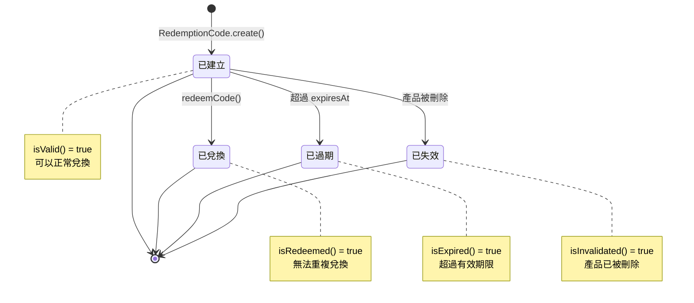

# 兌換模組設計與實作

本文件說明 LTDJMS Discord Bot 的兌換模組，負責兌換碼的生成、驗證與兌換流程，並與產品模組整合以實現自動獎勵發放。

## 1. 概述

兌換模組提供完整的兌換碼管理系統，允許管理員為產品生成唯一兌換碼，使用者輸入代碼即可兌換並獲得對應獎勵。系統支援到期時間設定、一碼一兌，並記錄兌換歷史。

主要功能：
- 兌換碼生成與管理
- 代碼驗證與兌換
- 到期時間支援
- 自動獎勵發放
- 兌換歷史追蹤
- 產品刪除時自動失效關聯的兌換碼

## 2. 領域模型

### 2.1 RedemptionCode

兌換碼實體，代表可兌換的代碼。

```java
// src/main/java/ltdjms/discord/redemption/domain/RedemptionCode.java
public record RedemptionCode(
    Long id,
    String code,
    Long productId,        // 對應產品 ID（可為 NULL，當產品被刪除時）
    long guildId,
    Instant expiresAt,
    Long redeemedBy,
    Instant redeemedAt,
    Instant createdAt,
    Instant invalidatedAt  // 失效時間（若關聯產品被刪除）
) {
    public static final int CODE_LENGTH = 16;
    public static final String CODE_CHARACTERS = "ABCDEFGHJKMNPQRSTUVWXYZ23456789";

    // 商業規則驗證
    public RedemptionCode {
        Objects.requireNonNull(code, "code must not be null");
        if (code.isBlank()) {
            throw new IllegalArgumentException("code must not be blank");
        }
        if (code.length() > 32) {
            throw new IllegalArgumentException("code must not exceed 32 characters");
        }
        // 確保 redeemed_by 和 redeemed_at 一致
        if ((redeemedBy == null) != (redeemedAt == null)) {
            throw new IllegalArgumentException(
                "redeemedBy and redeemedAt must both be specified or both be null");
        }
    }

    /**
     * 檢查是否已被兌換
     */
    public boolean isRedeemed() {
        return redeemedBy != null;
    }

    /**
     * 檢查是否已過期
     */
    public boolean isExpired() {
        return expiresAt != null && Instant.now().isAfter(expiresAt);
    }

    /**
     * 檢查是否已被失效
     * 當關聯產品被刪除時，兌換碼會被標記為失效
     */
    public boolean isInvalidated() {
        return invalidatedAt != null;
    }

    /**
     * 檢查是否可用
     * 必須同時滿足：未失效、未兌換、未過期
     */
    public boolean isValid() {
        return !isInvalidated() && !isRedeemed() && !isExpired();
    }

    /**
     * 建立已兌換的副本
     */
    public RedemptionCode withRedeemed(long userId) {
        if (isRedeemed()) {
            throw new IllegalStateException("Code has already been redeemed");
        }
        return new RedemptionCode(
            this.id, this.code, this.productId, this.guildId,
            this.expiresAt, userId, Instant.now(), this.createdAt, this.invalidatedAt
        );
    }

    /**
     * 建立已失效的副本
     */
    public RedemptionCode withInvalidated() {
        if (isInvalidated()) {
            throw new IllegalStateException("Code has already been invalidated");
        }
        return new RedemptionCode(
            this.id, this.code, null, this.guildId,
            this.expiresAt, this.redeemedBy, this.redeemedAt,
            this.createdAt, Instant.now()
        );
    }

    /**
     * 取得遮蔽後的代碼用於顯示
     * 只顯示前 4 字和後 4 字
     */
    public String getMaskedCode() {
        if (code.length() <= 8) {
            return code;
        }
        return code.substring(0, 4) + "****" + code.substring(code.length() - 4);
    }
}
```

關鍵商業規則：
- 代碼唯一性
- 兌換狀態一致性（若已兌換，必須有兌換時間）
- 到期檢查
- 失效檢查（當關聯產品被刪除時）

### 2.2 兌換碼狀態機

兌換碼有以下狀態，由領域模型的方法判斷：



### 2.3 RedemptionCodeGenerator

負責生成唯一兌換碼。

```java
// src/main/java/ltdjms/discord/redemption/services/RedemptionCodeGenerator.java
public class RedemptionCodeGenerator {
    private static final String CHARACTERS = "ABCDEFGHJKMNPQRSTUVWXYZ23456789";
    private static final int CODE_LENGTH = 16;

    /**
     * 生成隨機兌換碼
     * 排除易混淆字元: 0/O, 1/I/L
     */
    public String generate() {
        SecureRandom random = new SecureRandom();
        StringBuilder code = new StringBuilder(CODE_LENGTH);
        for (int i = 0; i < CODE_LENGTH; i++) {
            code.append(CHARACTERS.charAt(random.nextInt(CHARACTERS.length())));
        }
        return code.toString();
    }
}
```

**生成規則**：
- 長度：16 字元
- 字元集：`ABCDEFGHJKMNPQRSTUVWXYZ23456789`（排除易混淆字元 0/O、1/I/L）
- 生成時會檢查資料庫確保唯一性，最多重試 10 次

## 3. 服務層

### 3.1 RedemptionService

負責兌換相關的業務邏輯。

```java
// src/main/java/ltdjms/discord/redemption/services/RedemptionService.java
public class RedemptionService {
    private final RedemptionCodeRepository codeRepository;
    private final ProductRepository productRepository;
    private final RedemptionCodeGenerator codeGenerator;
    private final BalanceAdjustmentService balanceAdjustmentService;
    private final GameTokenService gameTokenService;
    private final CurrencyTransactionService currencyTransactionService;
    private final GameTokenTransactionService gameTokenTransactionService;
    private final DomainEventPublisher eventPublisher;

    public static final int MAX_BATCH_SIZE = 100;

    /**
     * 生成兌換碼
     */
    public Result<List<RedemptionCode>, DomainError> generateCodes(
        long productId, int count, Instant expiresAt) {

        // 驗證數量
        if (count <= 0) {
            return Result.err(DomainError.invalidInput("生成數量必須大於 0"));
        }
        if (count > MAX_BATCH_SIZE) {
            return Result.err(DomainError.invalidInput(
                String.format("單次最多生成 %d 個兌換碼", MAX_BATCH_SIZE)));
        }

        // 驗證產品存在
        var productOpt = productRepository.findById(productId);
        if (productOpt.isEmpty()) {
            return Result.err(DomainError.invalidInput("找不到商品"));
        }

        var product = productOpt.get();

        // 生成多個唯一代碼
        List<RedemptionCode> codes = new ArrayList<>(count);
        for (int i = 0; i < count; i++) {
            String codeStr = generateUniqueCode();
            var redemptionCode = RedemptionCode.create(
                codeStr, productId, product.guildId(), expiresAt);
            codes.add(redemptionCode);
        }

        // 批次儲存
        var savedCodes = codeRepository.saveAll(codes);

        // 發布事件以便面板即時刷新
        eventPublisher.publish(new RedemptionCodesGeneratedEvent(
            product.guildId(), productId, savedCodes.size()));

        return Result.ok(savedCodes);
    }

    /**
     * 兌換代碼（更新版）
     */
    public Result<RedemptionResult, DomainError> redeemCode(
        String codeStr, long guildId, long userId) {

        if (codeStr == null || codeStr.isBlank()) {
            return Result.err(DomainError.invalidInput("兌換碼無效"));
        }

        codeStr = codeStr.trim().toUpperCase();

        // 查詢代碼
        var codeOpt = codeRepository.findByCode(codeStr);
        if (codeOpt.isEmpty()) {
            return Result.err(DomainError.invalidInput("兌換碼無效"));
        }

        var code = codeOpt.get();

        // 檢查是否屬於此伺服器
        if (!code.belongsToGuild(guildId)) {
            return Result.err(DomainError.invalidInput("兌換碼無效"));
        }

        // 檢查是否已失效
        if (code.isInvalidated()) {
            return Result.err(DomainError.invalidInput("此兌換碼已失效"));
        }

        // 檢查是否已兌換
        if (code.isRedeemed()) {
            return Result.err(DomainError.invalidInput("此兌換碼已被使用"));
        }

        // 檢查是否已過期
        if (code.isExpired()) {
            return Result.err(DomainError.invalidInput("此兌換碼已過期"));
        }

        // 檢查產品是否存在（productId 為 NULL 表示產品已被刪除）
        if (code.productId() == null) {
            return Result.err(DomainError.invalidInput("此兌換碼已失效"));
        }

        var productOpt = productRepository.findById(code.productId());
        if (productOpt.isEmpty()) {
            return Result.err(DomainError.unexpectedFailure("商品資料異常", null));
        }

        var product = productOpt.get();

        // 標記代碼為已兌換
        var redeemedCode = code.withRedeemed(userId);
        codeRepository.update(redeemedCode);

        // 發放獎勵（如果有）
        Long rewardedAmount = null;
        if (product.hasReward()) {
            var rewardResult = grantReward(guildId, userId, product, code.code());
            if (rewardResult.isOk()) {
                rewardedAmount = rewardResult.getValue();
            }
        }

        var result = new RedemptionResult(redeemedCode, product, rewardedAmount);
        return Result.ok(result);
    }

    /**
     * 生成唯一代碼，檢查資料庫確保唯一性
     */
    private String generateUniqueCode() {
        int maxAttempts = 10;
        for (int i = 0; i < maxAttempts; i++) {
            String code = codeGenerator.generate();
            if (!codeRepository.existsByCode(code)) {
                return code;
            }
        }
        throw new IllegalStateException("Failed to generate unique code after " + maxAttempts + " attempts");
    }

    /**
     * 發放獎勵
     */
    private Result<Long, DomainError> grantReward(
        long guildId, long userId, Product product, String codeStr) {

        if (!product.hasReward()) {
            return Result.ok(null);
        }

        long amount = product.rewardAmount();
        String description = String.format("兌換碼: %s (%s)",
            codeStr.substring(0, 4) + "****", product.name());

        return switch (product.rewardType()) {
            case CURRENCY -> {
                var adjustResult = balanceAdjustmentService.tryAdjustBalance(
                    guildId, userId, amount);
                if (adjustResult.isOk()) {
                    currencyTransactionService.recordTransaction(
                        guildId, userId, amount,
                        adjustResult.getValue().newBalance(),
                        CurrencyTransaction.Source.REDEMPTION_CODE,
                        description);
                    yield Result.ok(amount);
                }
                yield Result.err(adjustResult.getError());
            }
            case TOKEN -> {
                var tokenResult = gameTokenService.tryAdjustTokens(
                    guildId, userId, amount);
                if (tokenResult.isOk()) {
                    gameTokenTransactionService.recordTransaction(
                        guildId, userId, amount,
                        tokenResult.getValue().newTokens(),
                        GameTokenTransaction.Source.REDEMPTION_CODE,
                        description);
                    yield Result.ok(amount);
                }
                yield Result.err(tokenResult.getError());
            }
        };
    }

    /**
     * 兌換結果
     */
    public record RedemptionResult(
        RedemptionCode code,
        Product product,
        Long rewardedAmount
    ) {
        public String formatSuccessMessage() {
            StringBuilder sb = new StringBuilder();
            sb.append("你已成功兌換「").append(product.name()).append("」");

            if (product.description() != null && !product.description().isBlank()) {
                sb.append("\n").append(product.description());
            }

            if (rewardedAmount != null && product.hasReward()) {
                sb.append("\n\n已發放獎勵：").append(product.formatReward());
            }

            return sb.toString();
        }
    }
}
```

主要方法：
- `generateCodes`: 為產品生成多個兌換碼（最多 100 個）
- `redeemCode`: 驗證並兌換代碼，包含完整的狀態檢查
- `findByCode`: 查詢代碼
- `getCodePage`: 取得分頁代碼列表
- `getCodeStats`: 取得代碼統計資訊

**兌換碼驗證流程**：

1. 代碼格式驗證（非空、去除空白、轉大寫）
2. 查詢代碼是否存在
3. 檢查是否屬於當前伺服器
4. 檢查是否已失效（`isInvalidated()`）
5. 檢查是否已兌換（`isRedeemed()`）
6. 檢查是否已過期（`isExpired()`）
7. 檢查關聯產品是否存在（`productId` 是否為 NULL）
8. 標記為已兌換並發放獎勵

## 4. 持久層

### 4.1 RedemptionCodeRepository

兌換碼資料存取介面。

```java
// src/main/java/ltdjms/discord/redemption/domain/RedemptionCodeRepository.java
public interface RedemptionCodeRepository {
    // 基本 CRUD
    Result<RedemptionCode, DomainError> save(RedemptionCode code);
    Result<List<RedemptionCode>, DomainError> saveAll(List<RedemptionCode> codes);
    Result<Optional<RedemptionCode>, DomainError> findById(Long id);
    Result<RedemptionCode, DomainError> update(RedemptionCode code);
    Result<Boolean, DomainError> deleteById(Long id);

    // 查詢方法
    Result<Optional<RedemptionCode>, DomainError> findByCode(String code);
    Result<List<RedemptionCode>, DomainError> findByProductId(Long productId, int limit, int offset);
    Result<Long, DomainError> countByProductId(Long productId);

    // 狀態檢查
    Result<Boolean, DomainError> existsByCode(String code);

    // 失效方法（V005 新增）
    /**
     * 將指定產品的所有兌換碼標記為失效
     * @param productId 產品 ID
     * @return 被失效的兌換碼數量
     */
    int invalidateByProductId(long productId);

    // 統計方法
    CodeStats getStatsByProductId(long productId);

    /**
     * 代碼統計資訊
     */
    record CodeStats(
        long totalCount,
        long unusedCount,
        long redeemedCount,
        long expiredCount,
        long invalidatedCount
    ) {}
}
```

### 4.2 JdbcRedemptionCodeRepository

JDBC 實作。

```java
// src/main/java/ltdjms/discord/redemption/persistence/JdbcRedemptionCodeRepository.java
public class JdbcRedemptionCodeRepository implements RedemptionCodeRepository {
    private final DSLContext dsl;

    @Override
    public int invalidateByProductId(long productId) {
        return dsl.update(REDEMPTION_CODE)
            .set(REDEMPTION_CODE.INVALIDATED_AT, Instant.now())
            .set(REDEMPTION_CODE.PRODUCT_ID, (Long) null)  // 設為 NULL（雖然外鍵也會做）
            .where(REDEMPTION_CODE.PRODUCT_ID.eq(productId))
            .and(REDEMPTION_CODE.INVALIDATED_AT.isNull())  // 只更新尚未失效的
            .execute();
    }

    @Override
    public CodeStats getStatsByProductId(long productId) {
        var record = dsl.select(
            count().as("total_count"),
            coalesce(count().filterWhere(REDEMPTION_CODE.REDEEMED_BY.isNull()
                .and(REDEMPTION_CODE.INVALIDATED_AT.isNull())), 0L).as("unused_count"),
            coalesce(count().filterWhere(REDEMPTION_CODE.REDEEMED_BY.isNotNull()), 0L).as("redeemed_count"),
            coalesce(count().filterWhere(REDEMPTION_CODE.EXPIRES_AT.lt(Instant.now())), 0L).as("expired_count"),
            coalesce(count().filterWhere(REDEMPTION_CODE.INVALIDATED_AT.isNotNull()), 0L).as("invalidated_count")
        )
        .from(REDEMPTION_CODE)
        .where(REDEMPTION_CODE.PRODUCT_ID.eq(productId))
        .fetchOne();

        return new CodeStats(
            record.get("total_count", Long.class),
            record.get("unused_count", Long.class),
            record.get("redeemed_count", Long.class),
            record.get("expired_count", Long.class),
            record.get("invalidated_count", Long.class)
        );
    }

    // ... 其他實作
}
```

## 5. 整合方式

### 5.1 與管理面板整合

兌換碼管理透過管理面板進行：

- 查看產品的代碼統計（總數、未使用、已兌換、已過期、已失效）
- 生成新代碼（支援指定數量和到期時間）
- 查看兌換歷史（分頁顯示）

```java
// AdminPanelService 中
public CodeStats getRedemptionCodeStats(long productId) {
    return redemptionService.getCodeStats(productId);
}
```

### 5.2 與產品模組整合

兌換系統依賴產品定義：

- 代碼生成時參考產品（記錄 `productId` 和 `guildId`）
- 兌換時取得獎勵資訊（依 `RewardType` 發放貨幣或代幣）
- **產品刪除時會失效所有關聯的兌換碼**（透過 `invalidateByProductId`）

### 5.3 產品刪除對兌換碼的影響

當產品被刪除時：

1. `ProductService.deleteProduct()` 會先呼叫 `RedemptionCodeRepository.invalidateByProductId()`
2. 所有關聯的兌換碼會被標記為失效（`invalidated_at` 設為當前時間）
3. 產品刪除後，由於外鍵約束 `ON DELETE SET NULL`，`redemption_code.product_id` 會自動設為 `NULL`
4. 這些已失效的兌換碼無法再被使用（`isValid()` 回傳 `false`）

**資料保留原則**：
- 兌換碼的使用記錄會被保留（`redeemed_by`、`redeemed_at`）
- 已失效的兌換碼仍可在資料庫中查詢到
- 統計資訊會包含失效的代碼數量

## 6. 使用範例

### 6.1 生成兌換碼

管理員為產品生成代碼：

1. 在產品管理中選擇產品
2. 點擊「生成代碼」
3. 指定數量（例如 100）和到期時間
4. 系統生成唯一代碼並儲存

### 6.2 兌換代碼

使用者兌換流程：

1. 管理員提供代碼給使用者
2. 使用者輸入代碼（可能透過專用指令或DM）
3. 系統驗證代碼有效性
4. 發放對應獎勵並標記已兌換

### 6.3 查看兌換統計

管理員查看產品兌換狀況：

- 總代碼數
- 已兌換數
- 剩餘可用數
- 最近兌換記錄

## 7. 錯誤處理

兌換模組的錯誤類型：

- `INVALID_INPUT`: 代碼不存在、重複兌換、已到期
- `INSUFFICIENT_BALANCE`: 理論上不會發生，因為是增加餘額
- `PERSISTENCE_FAILURE`: 資料庫操作失敗

## 8. 安全性考量

- 代碼唯一性確保無法重複使用
- 到期時間防止長期有效
- 兌換記錄追蹤使用情況
- 伺服器隔離防止跨伺服器兌換

## 9. 測試策略

- **單元測試**: 代碼生成邏輯、驗證規則
- **整合測試**: 完整兌換流程、資料庫互動
- **效能測試**: 大量代碼生成與查詢

---

兌換模組為產品系統提供完整的兌換機制，確保安全、可靠的獎勵發放。