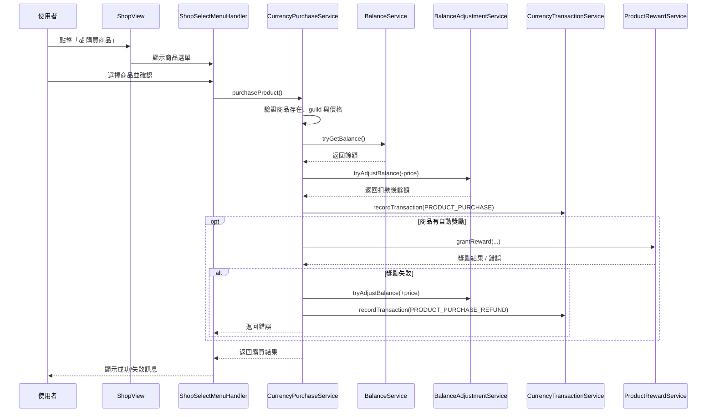

# 商店模組設計與實作

本文件說明 LTDJMS Discord Bot 的商店模組，提供成員瀏覽與購買產品的功能介面。

## 1. 概述

商店模組提供一個直觀的介面，讓伺服器成員可以瀏覽管理員建立的產品，並透過兩種方式取得獎勵：

1. **貨幣直接購買**：使用伺服器貨幣直接購買商品
2. **兌換碼兌換**：透過管理員發放的兌換碼領取獎勵

商店頁面支援分頁瀏覽，並與產品模組緊密整合。

主要功能：
- 瀏覽伺服器可購買的產品列表
- 產品資訊顯示（名稱、描述、價格、獎勵）
- 使用貨幣直接購買商品
- 分頁導航支援
- 與產品管理面板的整合

## 2. 領域模型

商店模組本身不定義獨立的領域模型，而是直接使用 `Product` 實體作為資料來源。

```java
// src/main/java/ltdjms/discord/product/domain/Product.java
public record Product(
    Long id,
    long guildId,
    String name,
    String description,
    RewardType rewardType,
    Long rewardAmount,
    Long currencyPrice,        // 新增：貨幣價格
    Instant createdAt,
    Instant updatedAt
) {
    // 獎勵格式化方法
    public boolean hasReward() {
        return rewardType != null && rewardAmount != null;
    }

    public String formatReward() {
        if (!hasReward()) return null;
        return switch (rewardType) {
            case CURRENCY -> String.format("%,d 貨幣", rewardAmount);
            case TOKEN -> String.format("%,d 代幣", rewardAmount);
        };
    }

    // 新增：檢查是否有貨幣價格
    public boolean hasCurrencyPrice() {
        return currencyPrice != null && currencyPrice > 0;
    }

    // 新增：格式化貨幣價格
    public String formatCurrencyPrice() {
        if (!hasCurrencyPrice()) return null;
        return String.format("%,d 貨幣", currencyPrice);
    }
}
```

**資料庫變更（V009 Migration）：**

```sql
-- 新增 currency_price 欄位
ALTER TABLE product ADD COLUMN currency_price BIGINT;

-- NULL 表示不可用貨幣購買（僅兌換碼）
-- 正值表示可用指定貨幣數量購買

-- 新增索引以優化可購買商品查詢
CREATE INDEX idx_product_currency_price
    ON product (guild_id, currency_price)
    WHERE currency_price IS NOT NULL;
```

## 3. 服務層

### 3.1 ShopService

負責商店頁面的資料查詢與分頁邏輯。

```java
// src/main/java/ltdjms/discord/shop/services/ShopService.java
public class ShopService {

    private static final int DEFAULT_PAGE_SIZE = 5;

    private final ProductRepository productRepository;

    public ShopService(ProductRepository productRepository) {
        this.productRepository = productRepository;
    }

    /**
     * 取得商店指定頁面的產品。
     *
     * @param guildId 伺服器 ID
     * @param page    頁碼（從 0 開始）
     * @return 商店頁面資料
     */
    public ShopPage getShopPage(long guildId, int page) {
        long totalCount = productRepository.countByGuildId(guildId);
        int totalPages = (int) Math.ceil((double) totalCount / DEFAULT_PAGE_SIZE);

        // 確保頁碼在有效範圍內
        int validPage = Math.max(0, Math.min(page, totalPages - 1));

        List<Product> products = productRepository.findByGuildIdPaginated(
            guildId, validPage, DEFAULT_PAGE_SIZE
        );

        return new ShopPage(products, validPage + 1, totalPages);
    }

    /**
     * 檢查商店是否有任何產品。
     */
    public boolean hasProducts(long guildId) {
        return productRepository.countByGuildId(guildId) > 0;
    }

    /**
     * 商店頁面資料。
     */
    public record ShopPage(
        List<Product> products,
        int currentPage,
        int totalPages
    ) {
        public boolean isEmpty() {
            return products.isEmpty();
        }

        public boolean hasPreviousPage() {
            return currentPage > 1;
        }

        public boolean hasNextPage() {
            return currentPage < totalPages;
        }

        public String formatPageIndicator() {
            if (totalPages <= 1) {
                return "共 " + products.size() + " 個商品";
            }
            return "第 " + currentPage + " / " + totalPages + " 頁";
        }
    }
}
```

主要方法：
- `getShopPage`: 取得指定頁面的產品列表
- `hasProducts`: 檢查是否有可顯示的產品

### 3.2 CurrencyPurchaseService

負責處理使用貨幣購買商品的業務邏輯，並協調自動獎勵。

目前實作依賴以下元件：

- `ProductService`: 查詢商品並驗證商品是否屬於當前 guild
- `BalanceService`: 讀取使用者目前餘額
- `BalanceAdjustmentService`: 扣款與退款
- `CurrencyTransactionService`: 記錄購買與退款交易
- `ProductRewardService`: 統一發放商品自動獎勵（貨幣或代幣）
購買流程：
1. 驗證商品存在、屬於當前 guild，且已設定貨幣價格
2. 查詢使用者貨幣餘額，若不足則回傳包含需求與現有餘額的錯誤
3. 扣除貨幣並記錄 `CurrencyTransaction.Source.PRODUCT_PURCHASE`
4. 若商品有自動獎勵，委派 `ProductRewardService.grantReward(...)` 發放
5. 若獎勵發放失敗，立即自動退款並記錄 `CurrencyTransaction.Source.PRODUCT_PURCHASE_REFUND`
6. 回傳 `PurchaseResult`，其中包含購買前餘額、最終餘額、價格與附加訊息

`PurchaseResult.formatSuccessMessage()` 會輸出：
- 商品名稱
- 商品價格
- 購買前 / 後餘額
- 自動獎勵資訊（若有）
## 4. 指令與介面

### 4.1 ShopCommandHandler

處理 `/shop` 指令，展示商店頁面。

```java
// src/main/java/ltdjms/discord/shop/commands/ShopCommandHandler.java
public class ShopCommandHandler implements SlashCommandListener.CommandHandler {

    private final ShopService shopService;

    @Override
    public void handle(SlashCommandInteractionEvent event) {
        if (!event.isFromGuild()) {
            event.reply("此功能只能在伺服器中使用").setEphemeral(true).queue();
            return;
        }

        long guildId = event.getGuild().getIdLong();

        try {
            ShopService.ShopPage shopPage = shopService.getShopPage(guildId, 0);

            MessageEmbed embed;
            List<ActionRow> components;

            if (shopPage.isEmpty()) {
                embed = ShopView.buildEmptyShopEmbed();
                components = List.of();
            } else {
                embed = ShopView.buildShopEmbed(
                    shopPage.products(),
                    shopPage.currentPage(),
                    shopPage.totalPages(),
                    guildId
                );
                components = ShopView.buildShopComponents(
                    shopPage.currentPage(),
                    shopPage.totalPages()
                );
            }

            event.replyEmbeds(embed)
                .addComponents(components)
                .queue();

        } catch (Exception e) {
            LOG.error("Error displaying shop page for guildId={}", guildId, e);
            event.reply("發生錯誤，請稍後再試").setEphemeral(true).queue();
        }
    }
}
```

### 4.2 ShopButtonHandler

處理商店頁面的分頁按鈕互動。

```java
// src/main/java/ltdjms/discord/shop/commands/ShopButtonHandler.java
public class ShopButtonHandler {

    private final ShopService shopService;

    @Override
    public void onButtonInteraction(ButtonInteractionEvent event) {
        long guildId = event.getGuild().getIdLong();
        String buttonId = event.getButton().getId();

        if (buttonId.startsWith(ShopView.BUTTON_PREV_PAGE)) {
            int page = parsePageNumber(buttonId, ShopView.BUTTON_PREV_PAGE);
            updateShopPage(event, guildId, page - 1);
        } else if (buttonId.startsWith(ShopView.BUTTON_NEXT_PAGE)) {
            int page = parsePageNumber(buttonId, ShopView.BUTTON_NEXT_PAGE);
            updateShopPage(event, guildId, page + 1);
        }
    }

    private void updateShopPage(ButtonInteractionEvent event, long guildId, int page) {
        ShopService.ShopPage shopPage = shopService.getShopPage(guildId, page - 1);

        MessageEmbed embed = ShopView.buildShopEmbed(
            shopPage.products(),
            shopPage.currentPage(),
            shopPage.totalPages(),
            guildId
        );
        List<ActionRow> components = ShopView.buildShopComponents(
            shopPage.currentPage(),
            shopPage.totalPages()
        );

        event.editMessageEmbeds(embed)
            .setActionRow(components)
            .queue();
    }
}
```

### 4.3 ShopSelectMenuHandler

處理購買選單與購買確認按鈕的互動。

```java
// src/main/java/ltdjms/discord/shop/commands/ShopSelectMenuHandler.java
public class ShopSelectMenuHandler extends ListenerAdapter {

    public static final String BUTTON_CONFIRM_PURCHASE = "shop_confirm_purchase_";
    public static final String BUTTON_CANCEL_PURCHASE = "shop_cancel_purchase";

    private final ProductService productService;
    private final BalanceService balanceService;
    private final CurrencyPurchaseService purchaseService;

    @Override
    public void onStringSelectInteraction(StringSelectInteractionEvent event) {
        if (!event.getComponentId().equals(ShopView.SELECT_PURCHASE_PRODUCT)) {
            return;
        }

        // 使用者選擇商品後，顯示購買確認介面
        long productId = Long.parseLong(event.getValues().get(0));
        productService.getProduct(productId).ifPresent(product -> {
            long userBalance = balanceService.tryGetBalance(guildId, userId)
                .getValue().balance();

            event.editMessageEmbeds(
                ShopView.buildPurchaseConfirmEmbed(product, userBalance)
            ).setComponents(ActionRow.of(
                Button.success(BUTTON_CONFIRM_PURCHASE + productId, "確認購買"),
                Button.secondary(BUTTON_CANCEL_PURCHASE, "取消")
            )).queue();
        });
    }

    @Override
    public void onButtonInteraction(ButtonInteractionEvent event) {
        // 處理確認購買按鈕
        if (event.getComponentId().startsWith(BUTTON_CONFIRM_PURCHASE)) {
            long productId = Long.parseLong(
                event.getComponentId().substring(BUTTON_CONFIRM_PURCHASE.length())
            );

            var result = purchaseService.purchaseProduct(guildId, userId, productId);
            if (result.isErr()) {
                event.reply("購買失敗：" + result.getError().message())
                    .setEphemeral(true).queue();
            } else {
                event.reply(result.getValue().formatSuccessMessage())
                    .setEphemeral(true).queue();
            }
        }
        // 處理取消按鈕
        else if (event.getComponentId().equals(BUTTON_CANCEL_PURCHASE)) {
            event.reply("已取消購買").setEphemeral(true).queue();
        }
    }
}
```

互動流程：
1. 使用者點擊「💰 購買商品」按鈕
2. 顯示商品選單（StringSelectMenu）
3. 使用者選擇商品後，顯示購買確認介面
4. 使用者確認後，執行購買並回傳結果

## 5. 視圖設計

### 5.1 ShopView

負責建構 Discord Embed 與互動元件。

```java
// src/main/java/ltdjms/discord/shop/services/ShopView.java
public class ShopView {

    private static final Color EMBED_COLOR = new Color(0x5865F2);
    private static final int PAGE_SIZE = 5;
    private static final String DIVIDER = "────────────────────────────────────";

    public static final String BUTTON_PREV_PAGE = "shop_prev_";
    public static final String BUTTON_NEXT_PAGE = "shop_next_";
    public static final String BUTTON_PURCHASE = "shop_purchase";        // 新增
    public static final String SELECT_PURCHASE_PRODUCT = "shop_purchase_select";  // 新增

    /**
     * 建構商店頁面的 Embed（含貨幣價格顯示）。
     */
    public static MessageEmbed buildShopEmbed(
        List<Product> products,
        int currentPage,
        int totalPages,
        long guildId
    ) {
        EmbedBuilder builder = new EmbedBuilder()
            .setTitle("🏪 商店")
            .setColor(EMBED_COLOR);

        StringBuilder sb = new StringBuilder();
        int startNumber = (currentPage - 1) * PAGE_SIZE + 1;
        for (int i = 0; i < products.size(); i++) {
            Product product = products.get(i);
            int number = startNumber + i;

            if (i > 0) {
                sb.append("\n").append(DIVIDER).append("\n");
            }

            sb.append("**").append(number).append(". ").append(product.name()).append("**");

            // 新增：顯示貨幣價格
            if (product.hasCurrencyPrice()) {
                sb.append("\n💰 價格：").append(product.formatCurrencyPrice());
            }

            if (product.description() != null && !product.description().isBlank()) {
                sb.append("\n商品描述：").append(product.description());
            }

            if (product.hasReward()) {
                sb.append("\n獎勵：").append(product.formatReward());
            }
        }

        builder.setDescription(sb.toString());
        builder.setFooter(totalPages > 1
            ? "第 " + currentPage + " / " + totalPages + " 頁"
            : "共 " + products.size() + " 個商品");

        return builder.build();
    }

    /**
     * 建構商店頁面的導航按鈕（含購買按鈕）。
     */
    public static List<ActionRow> buildShopComponents(
        int currentPage, int totalPages, List<Product> productsForPurchase
    ) {
        // 分頁按鈕
        Button prevButton = currentPage == 1
            ? Button.secondary(BUTTON_PREV_PAGE + (currentPage - 1), "⬅️ 上一頁").asDisabled()
            : Button.secondary(BUTTON_PREV_PAGE + (currentPage - 1), "⬅️ 上一頁");

        Button nextButton = currentPage >= totalPages
            ? Button.secondary(BUTTON_NEXT_PAGE + (currentPage + 1), "下一頁 ➡️").asDisabled()
            : Button.secondary(BUTTON_NEXT_PAGE + (currentPage + 1), "下一頁 ➡️");

        // 若無可購買商品，只返回分頁按鈕
        if (productsForPurchase.isEmpty()) {
            return List.of(ActionRow.of(prevButton, nextButton));
        }

        // 新增購買按鈕
        Button purchaseButton = Button.success(BUTTON_PURCHASE, "💰 購買商品");
        return List.of(
            ActionRow.of(prevButton, nextButton),
            ActionRow.of(purchaseButton)
        );
    }

    /**
     * 建構購買選單。
     */
    public static StringSelectMenu buildPurchaseMenu(List<Product> productsForPurchase) {
        StringSelectMenu.Builder menuBuilder = StringSelectMenu.create(SELECT_PURCHASE_PRODUCT)
            .setPlaceholder("選擇要購買的商品");

        for (Product product : productsForPurchase) {
            menuBuilder.addOption(
                product.name(),
                String.valueOf(product.id()),
                product.formatCurrencyPrice()
            );
        }

        return menuBuilder.build();
    }

    /**
     * 建構購買確認 Embed。
     */
    public static MessageEmbed buildPurchaseConfirmEmbed(Product product, long userBalance) {
        EmbedBuilder builder = new EmbedBuilder()
            .setTitle("💰 確認購買")
            .setColor(EMBED_COLOR);

        StringBuilder sb = new StringBuilder();
        sb.append("**商品：** ").append(product.name()).append("\n");
        sb.append("**價格：** ").append(product.formatCurrencyPrice()).append("\n");
        sb.append("**您的餘額：** ").append(String.format("%,d", userBalance)).append(" 貨幣\n");

        if (userBalance < product.currencyPrice()) {
            sb.append("\n⚠️ **餘額不足！**");
            builder.setColor(new Color(0xED4245));
        } else {
            long remaining = userBalance - product.currencyPrice();
            sb.append("**購買後餘額：** ").append(String.format("%,d", remaining)).append(" 貨幣");
        }

        builder.setDescription(sb.toString());
        return builder.build();
    }
}
```

### 5.2 商店頁面格式

**空商店狀態：**
```
🏪 商店
目前沒有可購買的商品
```

**一般商店狀態（含貨幣價格）：**
```
🏪 商店

────────────────────────────────────

**1. VIP 會員**
💰 價格：1,000 貨幣
商品描述：獲得額外福利
獎勵：1,000 貨幣

────────────────────────────────────

**2. 每日登入禮**
💰 價格：500 貨幣
商品描述：連續登入 7 天領取
獎勵：50 代幣

第 1 / 2 頁
```

**底部按鈕（若有可購買商品）：**
```
[⬅️ 上一頁] [下一頁 ➡️]
[💰 購買商品]
```

**購買確認介面：**
```
💰 確認購買

**商品：** VIP 會員
**價格：** 1,000 貨幣
**您的餘額：** 5,000 貨幣
**購買後餘額：** 4,000 貨幣

**商品描述：**
獲得額外福利

**獎勵：** 1,000 貨幣

[確認購買] [取消]
```

## 6. 使用方式

### 6.1 成員視角 - 貨幣購買流程

1. 成員輸入 `/shop` 指令
2. 系統顯示商店頁面，包含所有商品與貨幣價格
3. 若有可購買商品，點擊「💰 購買商品」按鈕
4. 從選單中選擇要購買的商品
5. 系統顯示購買確認介面（含餘額檢查）
6. 點擊「確認購買」完成交易
7. 系統扣除貨幣並發放獎勵（若有）

**餘額不足時：**
- 確認介面會顯示 ⚠️ 餘額不足警示
- 介面標題變為紅色
- 仍可確認但會回傳錯誤訊息

### 6.2 成員視角 - 兌換碼兌換

1. 管理員發放兌換碼給成員
2. 成員使用兌換碼進行兌換（詳見 `docs/modules/redemption.md`）

### 6.3 管理員視角

管理員透過管理面板管理產品：

1. 在 `/admin-panel` 中點選「產品管理」
2. 新增或編輯產品，可設定：
   - 商品名稱與描述
   - 貨幣價格（設為 0 或留空則僅支援兌換碼）
   - 獎勵類型與數量（可選）
3. 為產品生成兌換碼（若需要）
4. 將兌換碼發放給成員

## 7. 整合方式

### 7.1 與產品模組整合

商店模組依賴 `ProductRepository` 取得產品資料：

```java
// 商店模組依賴的 ProductRepository 方法
Result<List<Product>, DomainError> findByGuildId(Long guildId);
Result<List<Product>, DomainError> findByGuildIdPaginated(Long guildId, int page, int pageSize);
Result<Long, DomainError> countByGuildId(Long guildId);
Result<Product, DomainError> findById(Long id);
```

### 7.2 與貨幣系統整合

購買功能依賴以下服務：

```java
// 貨幣餘額查詢
BalanceService.tryGetBalance(guildId, userId)

// 貨幣扣除
BalanceAdjustmentService.tryAdjustBalance(guildId, userId, -amount)

// 交易記錄
CurrencyTransactionService.recordTransaction(
    guildId, userId, -amount, newBalance,
    CurrencyTransaction.Source.PRODUCT_PURCHASE, description
)
```

### 7.3 與領域事件整合

商店頁面可以訂閱 `ProductChangedEvent`，在產品異動時自動更新顯示。

## 8. 錯誤處理

商店模組的錯誤類型：

- `INVALID_INPUT`: 商品不存在、不可購買、餘額不足
- `PERSISTENCE_FAILURE`: 資料庫操作失敗
- `UNEXPECTED_FAILURE`: 其他非預期錯誤

錯誤發生時會以 ephemeral 訊息回覆使用者。

## 9. 購買流程時序圖



## 10. 擴充建議

若要擴充商店功能，建議考慮：

1. **商品分類與篩選**
   - 依獎勵類型分類顯示
   - 價格區間篩選

2. **商品圖片**
   - 支援商品圖片顯示
   - 使用 Embed thumbnail

3. **限時/限量商品**
   - 支援查看剩餘數量
   - 倒數計時器顯示

4. **購買紀錄**
   - 查看個人購買歷史
   - 退換貨機制

5. **折扣系統**
   - 會員等級折扣
   - 促銷活動

---

熟悉以上設計後，您可以依照相同模式擴充商店功能。
