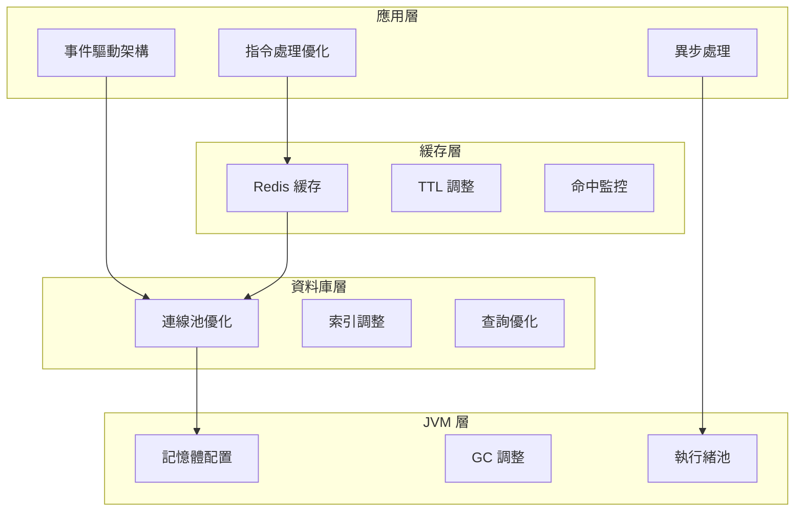

# 效能調優指南

本文件提供 LTDJMS Discord Bot 的效能調優策略與最佳實踐，涵蓋 JVM、資料庫、緩存與應用層面的優化建議。

## 1. 效能調優架構圖



---

## 2. JVM 效能調優

### 2.1 記憶體配置

**預設 JVM 參數：**
```bash
-Xmx512m -Xms256m
```

**建議配置（根據伺服器規格調整）：**

| 伺服器規格 | -Xmx (最大堆) | -Xms (初始堆) | -XX:MaxMetaspaceSize |
|-----------|--------------|--------------|---------------------|
| 1 GB RAM | 512m | 256m | 128m |
| 2 GB RAM | 1g | 512m | 256m |
| 4 GB RAM | 2g | 1g | 256m |

**docker-compose.yml 配置範例：**
```yaml
services:
  bot:
    environment:
      - JAVA_OPTS=-Xmx1g -Xms512m -XX:MaxMetaspaceSize=256m
```

### 2.2 GC 調整

**預設 GC（G1GC）通常已足夠：**
```bash
-XX:+UseG1GC -XX:MaxGCPauseMillis=200
```

**低延遲場景調優（大堆記憶體）：**
```bash
JAVA_OPTS="
  -Xmx2g
  -Xms1g
  -XX:+UseG1GC
  -XX:MaxGCPauseMillis=100
  -XX:G1HeapRegionSize=16m
  -XX:InitiatingHeapOccupancyPercent=45
  -XX:+PrintGCDetails
  -XX:+PrintGCDateStamps
"
```

**監控 GC 指標：**
```bash
# 查看 GC 統計
docker exec ltdjms-bot-1 jcmd 1 GC.heap_info

# 啟用 GC 日誌
-XX:+PrintGCDetails -XX:+PrintGCDateStamps -Xloggc:/tmp/gc.log
```

### 2.3 JVM 效能分析

**啟用 JFR（Java Flight Recorder）：**
```bash
JAVA_OPTS="
  -XX:StartFlightRecording=duration=60s,filename=/tmp/recording.jfr,dumponexit=true
"
```

**分析開銷：**
- 輕量：`< 1%` CPU
- 適合生產環境使用
- 可用 JDK Mission Control 開啟 .jfr 檔案

---

## 3. 資料庫效能調優

### 3.1 HikariCP 連線池配置

**預設配置：**
```properties
DB_POOL_MAX_SIZE=10
DB_POOL_MIN_IDLE=2
DB_POOL_CONNECTION_TIMEOUT=30000
DB_POOL_IDLE_TIMEOUT=600000
DB_POOL_MAX_LIFETIME=1800000
```

**建議配置（根據負載調整）：**

| 參數 | 低負載 (<10 QPS) | 中負載 (10-50 QPS) | 高負載 (>50 QPS) |
|------|------------------|-------------------|-----------------|
| maximumPoolSize | 5-10 | 15-25 | 30-50 |
| minimumIdle | 2 | 5 | 10 |
| connectionTimeout | 30000 | 20000 | 15000 |
| idleTimeout | 600000 | 300000 | 180000 |

**公式估算（經驗法則）：**
```
maximumPoolSize = 核心數 × 2 + 有效磁碟數
```

對於 Discord Bot（I/O 密集）：
```
maximumPoolSize = 核心數 × 4
```

### 3.2 索引優化

**現有索引（schema.sql）：**
```sql
-- 主鍵索引（自動建立）
PRIMARY KEY (guild_id, user_id)

-- 建議新增的索引
CREATE INDEX idx_member_currency_account_guild
    ON member_currency_account(guild_id);

CREATE INDEX idx_game_token_transaction_guild_user
    ON game_token_transaction(guild_id, user_id)
    WHERE created_at > NOW() - INTERVAL '30 days';
```

**索引設計原則：**
1. WHERE 子句欄位優先
2. JOIN 欄位建立索引
3. 排序欄位考慮索引
4. 避免過度索引（影響寫入效能）

### 3.3 查詢優化

**分頁查詢優化：**
```sql
-- 差（OFFSET 大時效能差）
SELECT * FROM product ORDER BY id LIMIT 10 OFFSET 1000;

-- 優（使用游標分頁）
SELECT * FROM product WHERE id > last_seen_id ORDER BY id LIMIT 10;
```

**N+1 問題預防：**
```java
// 差：N+1 查詢
for (Product product : products) {
    RedemptionCode code = codeRepo.findByProductId(product.id());
}

// 優：批次查詢
List<Long> productIds = products.stream().map(Product::id).toList();
Map<Long, List<RedemptionCode>> codesMap = codeRepo.findByProductIds(productIds);
```

### 3.4 慢查詢監控

**啟用 pg_stat_statements：**
```sql
-- postgresql.conf
shared_preload_libraries = 'pg_stat_statements'

-- 重啟後建立擴展
CREATE EXTENSION pg_stat_statements;

-- 查詢慢查詢
SELECT query, calls, total_time, mean_time
FROM pg_stat_statements
ORDER BY mean_time DESC
LIMIT 10;
```

---

## 4. Redis/緩存效能調優

### 4.1 緩存命中率優化

**監控命中率：**
```bash
# Redis CLI
redis-cli info stats | grep keyspace

# 計算命中率
命中率 = keyspace_hits / (keyspace_hits + keyspace_misses)
```

**目標命中率：**
- 理想：> 90%
- 可接受：> 70%
- 需優化：< 50%

### 4.2 TTL 調整策略

| 資料類型 | 預設 TTL | 調整建議 |
|---------|---------|----------|
| 貨幣餘額 | 300 秒 | 高頻變更 → 180 秒<br>低頻變更 → 600 秒 |
| 遊戲代幣 | 300 秒 | 同上 |
| 產品資訊 | 600 秒 | 變更少 → 1800 秒 |
| 設定資料 | 3600 秒 | 幾乎不變 → 86400 秒 |

**動態 TTL 實作建議：**
```java
// 根據訪問頻率調整 TTL
int calculateTTL(String entityType) {
    long accessCount = getAccessCount(entityType);
    if (accessCount > 1000) return 600;  // 熱點資料延長
    if (accessCount < 10) return 120;    // 冷門資料縮短
    return 300;                          // 預設
}
```

### 4.3 Redis 記憶體優化

**記憶體監控：**
```bash
# 查看記憶體使用
redis-cli info memory

# 設定最大記憶體與淘汰策略
redis-cli CONFIG SET maxmemory 256mb
redis-cli CONFIG SET maxmemory-policy allkeys-lru
```

**淘汰策略選擇：**
| 策略 | 說明 | 適用場景 |
|------|------|----------|
| `noeviction` | 不淘汰，滿了回傳錯誤 | 快取必須命中 |
| `allkeys-lru` | 淘汰最少使用的鍵 | 通用場景 |
| `volatile-lru` | 只淘汰有 TTL 的鍵 | 保留永久資料 |

### 4.4 緩存雪崩預防

**預防措施：**
```java
// TTL 加上隨機偏移，避免大量同時過期
int ttl = baseTtl + ThreadLocalRandom.current().nextInt(60);
cacheService.put(key, value, ttl);
```

---

## 5. 應用層效能優化

### 5.1 指令處理優化

**非同步回應（高負載場景）：**
```java
// 同步回應（預設）
event.reply("訊息").queue();

// 非同步回應（減少等待）
event.reply("訊息").queue(v -> {
    // 回應成功後的處理
}, e -> {
    // 錯誤處理
});
```

**Embed 優化：**
```java
// 差：過多 Embed 欄位
EmbedBuilder builder = new EmbedBuilder()
    .addField("欄位1", "值", false)
    .addField("欄位2", "值", false)
    // ... 20+ 欄位

// 優：合併欄位，減少 Discord API 調用
EmbedBuilder builder = new EmbedBuilder()
    .addField("綜合資訊", "多個值合併", false);
```

### 5.2 事件驅動優化

**批次事件發布：**
```java
// 差：每次發布一個事件
for (User user : users) {
    eventPublisher.publish(new UserChangedEvent(user));
}

// 優：批次發布
List<DomainEvent> events = users.stream()
    .map(UserChangedEvent::new)
    .toList();
eventPublisher.publishBatch(events);
```

### 5.3 資料結構優化

**使用適當的資料結構：**
```java
// 差：頻繁的 List 查找
List<Product> products = ...;
Product found = products.stream()
    .filter(p -> p.id() == targetId)
    .findFirst();

// 優：使用 Map
Map<Long, Product> productMap = products.stream()
    .collect(Collectors.toMap(Product::id, Function.identity()));
Product found = productMap.get(targetId);
```

---

## 6. 效能測試與基準

### 6.1 效能測試工具

**使用 JMH（Java Microbenchmark Harness）：**
```xml
<dependency>
    <groupId>org.openjdk.jmh</groupId>
    <artifactId>jmh-core</artifactId>
    <version>1.37</version>
    <scope>test</scope>
</dependency>
```

**基準測試範例：**
```java
@BenchmarkMode(Mode.AverageTime)
@OutputTimeUnit(TimeUnit.MILLISECONDS)
@State(Scope.Benchmark)
public class CacheServiceBenchmark {
    private CacheService cacheService;

    @Setup
    public void setup() {
        cacheService = new RedisCacheService("redis://localhost:6379");
    }

    @Benchmark
    public void cacheGet(Blackhole blackhole) {
        blackhole.consume(cacheService.get("test:key", Long.class));
    }
}
```

### 6.2 負載測試

**使用 K6 或 Gatling：**
```javascript
// k6 腳本範例
import http from 'k6/http';

export default function() {
    const url = 'http://localhost:8080/api/endpoint';
    const params = { headers: { 'Content-Type': 'application/json' } };
    http.post(url, JSON.stringify({ test: 'data' }), params);
}
```

**執行負載測試：**
```bash
k6 run --vus 100 --duration 30s load-test.js
```

### 6.3 效能基準

**指令執行時間基準：**

| 指令類型 | 目標延遲 | 可接受 | 需優化 |
|---------|---------|--------|--------|
| 簡單查詢（/user-panel） | < 100ms | < 200ms | > 300ms |
| 複雜計算（/dice-game-2） | < 200ms | < 500ms | > 1000ms |
| 資料庫寫入（調整餘額） | < 300ms | < 600ms | > 1500ms |

**吞吐量基準（單實例）：**
- 低負載：< 10 QPS
- 中負載：10-50 QPS
- 高負載：> 50 QPS

---

## 7. 監控與警報

### 7.1 關鍵效能指標（KPI）

| 指標 | 目標值 | 警告閾值 | 嚴重閾值 |
|------|--------|----------|----------|
| P95 指令延遲 | < 200ms | > 500ms | > 1000ms |
| 錯誤率 | < 0.1% | > 1% | > 5% |
| 資料庫連線池使用率 | < 70% | > 85% | > 95% |
| 緩存命中率 | > 80% | < 60% | < 40% |
| GC 暫停時間 | < 100ms | > 200ms | > 500ms |

### 7.2 效能監控儀表板

**Prometheus + Grafana 範例：**
```yaml
# prometheus.yml
scrape_configs:
  - job_name: 'ltdjms'
    static_configs:
      - targets: ['localhost:8080']
    metrics_path: '/metrics'
```

**建議的 Grafana 面板：**
1. 指令執行時間分佈
2. 錯誤率趨勢
3. 資料庫連線池狀態
4. 緩存命中率
5. JVM 記憶體與 GC
6. Discord API 速率限制

---

## 8. 效能調優檢查清單

### 8.1 初級調優（必須）

- [ ] JVM 記憶體設定適當（-Xmx, -Xms）
- [ ] 資料庫連線池設定合理
- [ ] Redis 緩存已啟用
- [ ] 基礎索引已建立
- [ ] 日誌層級設為 INFO（生產環境）

### 8.2 中級調優（建議）

- [ ] GC 參數已調整
- [ ] 緩存 TTL 已優化
- [ ] 慢查詢已分析並優化
- [ ] N+1 查詢問題已解決
- [ ] 事件處理已批次化

### 8.3 高級調優（可選）

- [ ] 使用 JFR 進行效能分析
- [ ] 實作基準測試套件
- [ ] 部署監控儀表板
- [ ] 設定自動化效能警報
- [ ] 考慮水平擴展策略

---

## 9. 水平擴展建議

### 9.1 多實例部署

**負載均衡考量：**
- Discord Bot 不適合多實例同時連線（會重複處理事件）
- 建議使用單實例 + 垂直擴展
- 或使用分片架構（Sharding）

### 9.2 垂直擴展

**升級路徑：**
1. **1 GB RAM** → 開發/測試環境
2. **2 GB RAM** → 小型生產環境（< 100 伺服器）
3. **4 GB RAM** → 中型生產環境（100-500 伺服器）
4. **8+ GB RAM** → 大型生產環境（500+ 伺服器）

---

## 10. 相關文件

- [緩存架構詳解](../architecture/cache-architecture.md)
- [監控與日誌](monitoring.md)
- [故障排除](troubleshooting.md)
- [開發除錯指南](../development/debugging.md)
