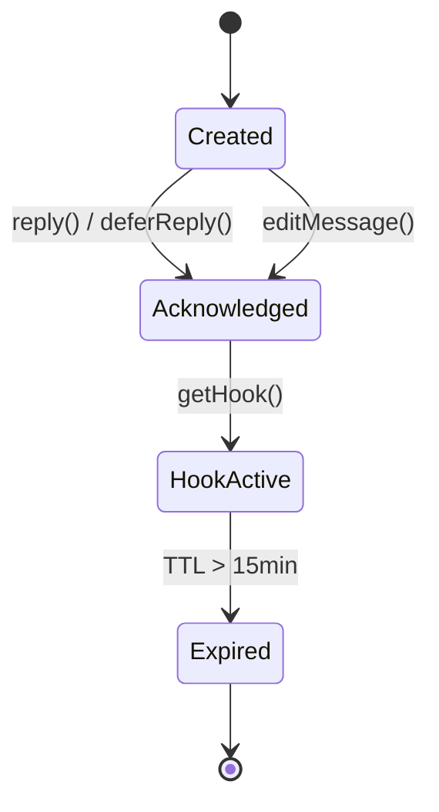
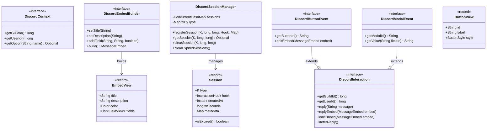
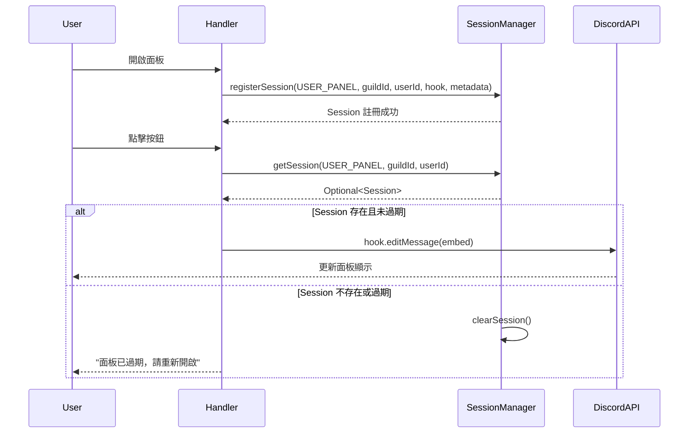
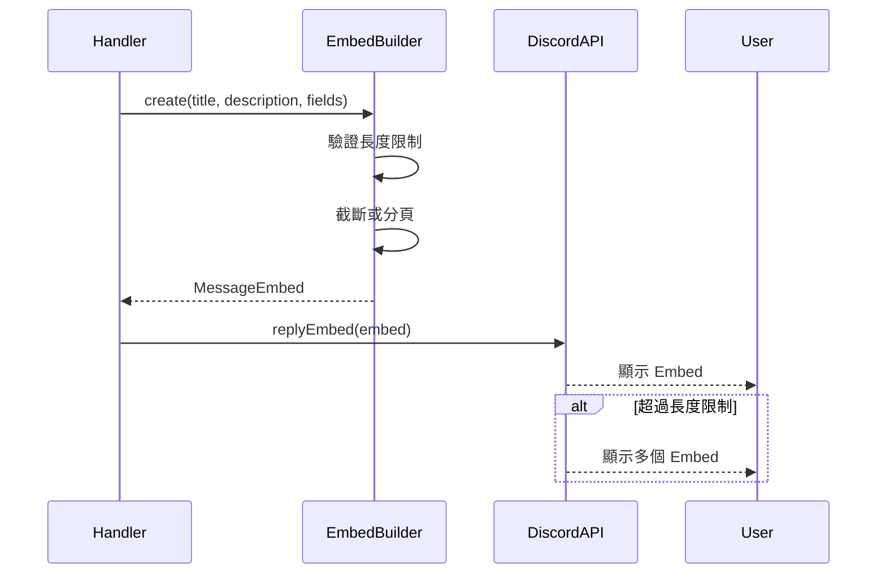

# Data Model: Discord API 抽象層

**Feature**: Discord API 抽象層
**Date**: 2025-12-27
**Status**: Phase 1 - Design

---

## 概述

本文檔定義 Discord API 抽象層的核心實體、值物件和它們之間的關係。由於此功能不涉及資料庫持久化，所有實體均為記憶體中的值物件或介面定義。

---

## 核心實體

### 1. DiscordInteraction

**類型**: 介面（Interface）
**用途**: 統一的 Discord 互動回應抽象

**屬性**:

| 名稱 | 類型 | 可為空 | 描述 |
|------|------|--------|------|
| guildId | long | 否 | Guild ID |
| userId | long | 否 | 使用者 ID |
| isAcknowledged | boolean | 否 | 互動是否已被確認 |
| hook | InteractionHook | 否 | JDA InteractionHook（實作類別使用） |

**方法**:

```java
public interface DiscordInteraction {
    long getGuildId();
    long getUserId();
    boolean isEphemeral();
    void reply(String message);
    void replyEmbed(MessageEmbed embed);
    void editEmbed(MessageEmbed embed);
    void deferReply();
    InteractionHook getHook();
}
```

**實作類別**:
- `JdaDiscordInteraction`: JDA 事件的介面卡實作
- `MockDiscordInteraction`: 測試用的 Mock 實作

**狀態轉換**:



---

### 2. DiscordContext

**類型**: 介面（Interface）
**用途**: 從 Discord 事件中提取上下文資訊

**屬性**:

| 名稱 | 類型 | 可為空 | 描述 |
|------|------|--------|------|
| guildId | long | 否 | Guild ID |
| userId | long | 否 | 使用者 ID |
| channelId | long | 否 | 頻道 ID |
| userMention | String | 否 | 使用者 Mention 格式 |
| options | Map<String, OptionMapping> | 否 | 命令參數映射 |

**方法**:

```java
public interface DiscordContext {
    long getGuildId();
    long getUserId();
    long getChannelId();
    String getUserMention();
    Optional<String> getOption(String name);
    Optional<String> getOptionAsString(String name);
    Optional<Long> getOptionAsLong(String name);
    Optional<User> getOptionAsUser(String name);
}
```

**實作類別**:
- `JdaDiscordContext`: 從 JDA 事件提取上下文
- `MockDiscordContext`: 測試用的 Mock 實作

---

### 3. DiscordEmbedBuilder

**類型**: 介面（Interface）
**用途**: Discord 視圖元件建構器抽象

**方法**:

```java
public interface DiscordEmbedBuilder {
    DiscordEmbedBuilder setTitle(String title);
    DiscordEmbedBuilder setDescription(String description);
    DiscordEmbedBuilder setColor(Color color);
    DiscordEmbedBuilder addField(String name, String value, boolean inline);
    DiscordEmbedBuilder setFooter(String text);
    MessageEmbed build();
}
```

**實作類別**:
- `JdaDiscordEmbedBuilder`: 包裝 JDA 的 `EmbedBuilder`
- `MockDiscordEmbedBuilder`: 測試用，追蹤建構過程

**Discord API 限制**:

| 限制項 | 限制值 | 驗證方法 |
|--------|--------|----------|
| Title | 256 字元 | `truncateWithEllipsis()` |
| Description | 4096 字元 | `buildPaginatedEmbeds()` |
| Field Name | 256 字元 | `truncateWithEllipsis()` |
| Field Value | 1024 字元 | `truncateWithEllipsis()` |
| Fields | 25 個 | `limit(25)` |

---

### 4. DiscordSessionManager

**類型**: 泛型類別（Generic Class）
**用途**: 管理互動 Session 的註冊、更新、失效

**泛型參數**: `K extends Enum<K> & SessionType`

**屬性**:

| 名稱 | 類型 | 描述 |
|------|------|------|
| sessions | ConcurrentHashMap<String, Session<K>> | Session 儲存映射 |
| ttlByType | Map<K, Long> | 各類型 Session 的 TTL（秒） |
| DEFAULT_TTL_SECONDS | long (常量) | 預設 TTL：15 分鐘 |

**方法**:

```java
public class InteractionSessionManager<K extends Enum<K> & SessionType> {
    public void registerSession(K type, long guildId, long userId,
                               InteractionHook hook, Map<String, Object> metadata);
    public Optional<Session<K>> getSession(K type, long guildId, long userId);
    public void clearSession(K type, long guildId, long userId);
    public void clearExpiredSessions();
    private String getKey(K type, long guildId, long userId);
}
```

**Session 記錄**:

```java
public record Session<K>(
    K type,
    InteractionHook hook,
    Instant createdAt,
    long ttlSeconds,
    Map<String, Object> metadata
) {
    public boolean isExpired() {
        return Instant.now().isAfter(createdAt.plusSeconds(ttlSeconds));
    }
}
```

**SessionKey 格式**: `{SessionType}:{guildId}:{userId}`

**TTL 配置**:

| Session 類型 | TTL | 理由 |
|--------------|-----|------|
| ADMIN_PANEL | 15 分鐘 | Discord InteractionHook 限制 |
| USER_PANEL | 15 分鐘 | Discord InteractionHook 限制 |
| SHOP_PURCHASE | 5 分鐘 | 購買流程較短 |
| REDEMPTION_FLOW | 5 分鐘 | 兌換流程較短 |

---

### 5. DiscordButtonEvent / DiscordModalEvent

**類型**: 介面（Interface），繼承自 `DiscordInteraction`
**用途**: 特定事件類型的抽象

**DiscordButtonEvent**:

```java
public interface DiscordButtonEvent extends DiscordInteraction {
    String getButtonId();
    void editEmbed(MessageEmbed embed);
    void editComponents(List<ActionRow> components);
}
```

**DiscordModalEvent**:

```java
public interface DiscordModalEvent extends DiscordInteraction {
    String getModalId();
    String getValue(String fieldId);
}
```

---

## 值物件

### EmbedView

**用途**: Embed 視圖的不可變資料結構

```java
public record EmbedView(
    String title,
    String description,
    Color color,
    List<FieldView> fields,
    String footer
) {}

public record FieldView(
    String name,
    String value,
    boolean inline
) {}
```

### ButtonView

**用途**: 按鈕視圖的不可變資料結構

```java
public record ButtonView(
    String id,
    String label,
    ButtonStyle style,
    boolean disabled
) {}
```

### SelectMenuView

**用途**: 選擇選單視圖的不可變資料結構

```java
public record SelectMenuView(
    String id,
    String placeholder,
    List<SelectOptionView> options,
    int minValues,
    int maxValues
) {}

public record SelectOptionView(
    String value,
    String label,
    String description,
    Emoji emoji
) {}
```

### ModalView

**用途**: Modal 對話框視圖的不可變資料結構

```java
public record ModalView(
    String id,
    String title,
    List<TextInputView> inputs
) {}

public record TextInputView(
    String id,
    String label,
    TextInputStyle style,
    String placeholder,
    int minLength,
    int maxLength,
    boolean required
) {}
```

---

## 關聯圖



---

## 驗證規則

### DiscordInteraction

1. **guildId 和 userId 必須為有效值**: 大於 0
2. **reply() 只能在未確認時呼叫**: 否則使用 Hook
3. **editEmbed() 只能在已確認後呼叫**: 否則使用 reply

### DiscordEmbedBuilder

1. **Title 不可超過 256 字元**: 自動截斷並附加 "..."
2. **Description 不可超過 4096 字元**: 分頁或截斷
3. **Field Name 不可超過 256 字元**: 自動截斷
4. **Field Value 不可超過 1024 字元**: 自動截斷
5. **Fields 不可超過 25 個**: 自動限制

### DiscordSessionManager

1. **SessionKey 必須唯一**: `{type}:{guildId}:{userId}`
2. **TTL 不可超過 15 分鐘**: Discord InteractionHook 限制
3. **過期 Session 必須自動清理**: 每次 `getSession()` 時檢查

---

## 資料流

### Session 生命週期



### Embed 建構與發送



---

## 錯誤處理

### DiscordError 類型

| 錯誤類型 | 觸發條件 | 使用者訊息 |
|----------|----------|-----------|
| INTERACTION_TIMEOUT | 3 秒內未回應 | "操作已超時，請重新執行" |
| HOOK_EXPIRED | Hook 超過 15 分鐘 | "面板已過期，請重新開啟" |
| UNKNOWN_MESSAGE | 訊息不存在或已刪除 | "訊息不存在，請重新整理" |
| RATE_LIMITED | 超過 Rate Limit | "請求過於頻繁，請稍後再試" |
| MISSING_PERMISSIONS | 機器人缺少權限 | "機器人缺少必要權限" |
| INVALID_COMPONENT_ID | 無效的元件 ID | "無效的操作" |

---

**Phase 1 狀態**: ✅ COMPLETE
