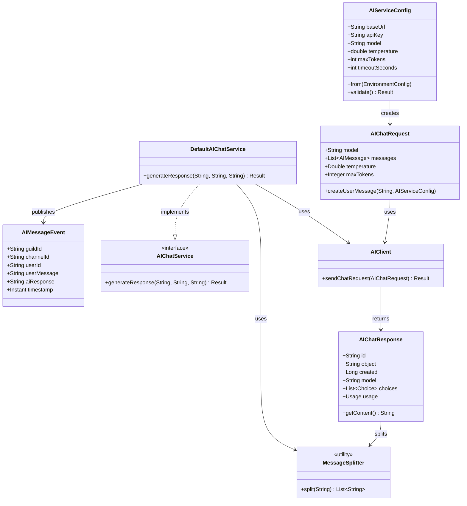

# Data Model: AI Chat Mentions

**Feature**: AI Chat Mentions (003-ai-chat)
**Date**: 2025-12-28
**Status**: Draft

## Overview

本文件定義 AI Chat 功能的領域模型。由於此功能不涉及資料庫持久化，所有模型都是純記憶體的領域物件。

---

## Domain Entities

### 1. AIServiceConfig

**套件路徑**: `ltdjms.discord.aichat.domain.AIServiceConfig`

**說明**: AI 服務配置，包含連線資訊與參數。

**欄位**:

| 欄位名稱 | 型別 | 說明 | 驗證規則 |
|---------|------|------|---------|
| `baseUrl` | `String` | AI 服務 Base URL | 必填，非空白 |
| `apiKey` | `String` | API 金鑰 | 必填，非空白 |
| `model` | `String` | 模型名稱 | 必填，非空白 |
| `temperature` | `double` | 溫度 (0.0-2.0) | 0.0 <= temperature <= 2.0 |
| `maxTokens` | `int` | 最大 Token 數 | 1 <= maxTokens <= 4096 |
| `timeoutSeconds` | `int` | 連線逾時秒數（不限制推理時間） | 1 <= timeoutSeconds <= 120 |

**工廠方法**:

```java
public static AIServiceConfig from(EnvironmentConfig env)
```

**驗證方法**:

```java
public Result<Unit, DomainError> validate()
```

**狀態遷移**: N/A (不可變配置)

---

### 2. AIChatRequest

**套件路徑**: `ltdjms.discord.aichat.domain.AIChatRequest`

**說明**: AI 聊天請求模型，符合 OpenAI Chat Completions API 格式。

**欄位**:

| 欄位名稱 | 型別 | 說明 | JSON 名稱 |
|---------|------|------|---------|
| `model` | `String` | 模型名稱 | `model` |
| `messages` | `List<AIMessage>` | 訊息列表 | `messages` |
| `temperature` | `Double` | 溫度 | `temperature` |
| `maxTokens` | `Integer` | 最大 Token 數 | `max_tokens` |

**巢狀類別**:

```java
public record AIMessage(
    String role,      // "user" 或 "assistant"
    String content    // 訊息內容
) {}
```

**工廠方法**:

```java
public static AIChatRequest createUserMessage(String content, AIServiceConfig config)
```

**JSON 序列化範例**:

```json
{
  "model": "gpt-3.5-turbo",
  "messages": [
    {
      "role": "user",
      "content": "你好，今天天氣如何？"
    }
  ],
  "temperature": 0.7,
  "max_tokens": 500
}
```

---

### 3. AIChatResponse

**套件路徑**: `ltdjms.discord.aichat.domain.AIChatResponse`

**說明**: AI 回應模型，符合 OpenAI Chat Completions API 格式。

**欄位**:

| 欄位名稱 | 型別 | 說明 | JSON 名稱 |
|---------|------|------|---------|
| `id` | `String` | 回應 ID | `id` |
| `object` | `String` | 物件類型 | `object` |
| `created` | `Long` | 建立時間戳 | `created` |
| `model` | `String` | 使用的模型 | `model` |
| `choices` | `List<Choice>` | 選擇列表 | `choices` |
| `usage` | `Usage` | Token 使用量 | `usage` |

**巢狀類別**:

```java
public record Choice(
    Integer index,           // 選擇索引
    AIMessage message,       // 訊息內容
    String finishReason      // 結束原因 ("stop", "length", "content_filter")
) {
    public record AIMessage(
        String role,         // "assistant"
        String content       // 回應內容
    ) {}
}

public record Usage(
    Integer promptTokens,      // 提示詞 Token 數
    Integer completionTokens,  // 完成 Token 數
    Integer totalTokens        // 總 Token 數
) {}
```

**便捷方法**:

```java
public String getContent()  // 提取第一個選擇的內容
```

**JSON 範例**:

```json
{
  "id": "chatcmpl-123",
  "object": "chat.completion",
  "created": 1677652288,
  "model": "gpt-3.5-turbo",
  "choices": [
    {
      "index": 0,
      "message": {
        "role": "assistant",
        "content": "我是一個 AI 助手，無法獲取即時天氣資訊。建議您查詢天氣應用程式。"
      },
      "finish_reason": "stop"
    }
  ],
  "usage": {
    "prompt_tokens": 10,
    "completion_tokens": 20,
    "total_tokens": 30
  }
}
```

---

### 4. AIMessageEvent

**套件路徑**: `ltdjms.discord.aichat.domain.AIMessageEvent`

**說明**: AI 訊息事件，用於通知其他模組 AI 訊息已發送。

**繼承**: `extends DomainEvent`

**欄位**:

| 欄位名稱 | 型別 | 說明 |
|---------|------|------|
| `guildId` | `String` | Discord 伺服器 ID |
| `channelId` | `String` | Discord 頻道 ID |
| `userId` | `String` | 使用者 ID |
| `userMessage` | `String` | 使用者原始訊息 |
| `aiResponse` | `String` | AI 回應內容 |
| `timestamp` | `Instant` | 事件時間戳 |

**用途**:
- 日誌記錄
- 統計分析
- 未來擴展（如對話歷史保存）

---

## Service Contracts

### AIChatService

**套件路徑**: `ltdjms.discord.aichat.services.AIChatService`

**說明**: AI 聊天服務介面，負責處理 AI 請求並發送 Discord 回應。

**方法**:

```java
/**
 * 生成 AI 回應並發送到 Discord 頻道
 *
 * @param channelId Discord 頻道 ID
 * @param userId 使用者 ID
 * @param userMessage 使用者訊息
 * @return Result<Unit, DomainError> 成功或錯誤
 */
Result<Unit, DomainError> generateResponse(
    String channelId,
    String userId,
    String userMessage
);
```

**錯誤類型**:

| DomainError.Category | 觸發條件 |
|---------------------|---------|
| `INVALID_INPUT` | 訊息為空白、頻道 ID 無效 |
| `AI_SERVICE_AUTH_FAILED` | API 金鑰無效 (HTTP 401) |
| `AI_SERVICE_RATE_LIMITED` | 速率限制 (HTTP 429) |
| `AI_SERVICE_TIMEOUT` | 連線逾時 |
| `AI_SERVICE_UNAVAILABLE` | 服務不可用 (HTTP 5xx) |
| `AI_RESPONSE_EMPTY` | AI 回應為空 |
| `AI_RESPONSE_INVALID` | AI 回應格式無效 |
| `UNEXPECTED_FAILURE` | 未預期錯誤 |

---

### AIClient

**套件路徑**: `ltdjms.discord.aichat.services.AIClient`

**說明**: AI HTTP 客戶端，負責與 AI 服務通訊。

**方法**:

```java
/**
 * 發送聊天請求到 AI 服務
 *
 * @param request AI 聊天請求
 * @return Result<AIChatResponse, DomainError> AI 回應或錯誤
 */
Result<AIChatResponse, DomainError> sendChatRequest(AIChatRequest request);
```

**依賴**:
- `java.net.http.HttpClient` (Java 17 內建)
- `AIServiceConfig`

---

## Value Objects

### MessageSplitter

**套件路徑**: `ltdjms.discord.aichat.services.MessageSplitter`

**說明**: 訊息分割工具，將長訊息分割為符合 Discord 限制的多則訊息。

**常數**:

```java
private static final int MAX_MESSAGE_LENGTH = 1980; // 預留 20 字元緩衝
```

**方法**:

```java
/**
 * 分割訊息為多則訊息
 *
 * @param content 原始內容
 * @return List<String> 分割後的訊息列表
 */
public static List<String> split(String content);
```

**分割策略**:
1. 優先在換行符號 `\n` 處分割
2. 其次在句號 `。`、`！`、`？` 處分割
3. 最後在 1980 字元處強制分割

---

## Error Model

### 新增 DomainError 類型

在 `ltdjms.discord.shared.DomainError.Category` 中新增：

```java
public enum Category {
    // ... 現有類型
    AI_SERVICE_TIMEOUT,           // AI 服務連線逾時
    AI_SERVICE_AUTH_FAILED,       // AI 服務認證失敗
    AI_SERVICE_RATE_LIMITED,      // AI 服務速率限制
    AI_SERVICE_UNAVAILABLE,       // AI 服務不可用
    AI_RESPONSE_EMPTY,            // AI 回應為空
    AI_RESPONSE_INVALID,          // AI 回應格式無效
}
```

### 使用者訊息對應

| 錯誤類型 | 使用者看到的訊息 |
|---------|-----------------|
| `AI_SERVICE_AUTH_FAILED` | `:x: AI 服務認證失敗，請聯絡管理員` |
| `AI_SERVICE_RATE_LIMITED` | `:timer: AI 服務暫時忙碌，請稍後再試` |
| `AI_SERVICE_TIMEOUT` | `:hourglass: AI 服務連線逾時，請稍後再試` |
| `AI_SERVICE_UNAVAILABLE` | `:warning: AI 服務暫時無法使用` |
| `AI_RESPONSE_EMPTY` | `:question: AI 沒有產生回應` |
| `AI_RESPONSE_INVALID` | `:warning: AI 回應格式錯誤` |

---

## Relationships



---

## Validation Rules Summary

| 實體 | 驗證規則 |
|------|---------|
| **AIServiceConfig** | `baseUrl` 非空白、`apiKey` 非空白、`model` 非空白、`temperature` 0.0-2.0、`maxTokens` 1-4096、`timeoutSeconds` 1-120 |
| **AIChatRequest** | `messages` 非空、至少包含一則 user 訊息 |
| **AIChatResponse** | `choices` 非空、第一個選擇包含有效 `content` |
| **使用者訊息** | 非空白（或使用預設問候語） |

---

## State Transitions

無狀態設計，不涉及狀態遷移。

---

## Persistence Strategy

**N/A** - 此功能不涉及資料庫持久化。

所有資料都存在於記憶體中：
- `AIServiceConfig`: 應用啟動時載入，保持不變
- `AIChatRequest`/`AIChatResponse`: 每次請求建立新的實例
- `AIMessageEvent`: 發布後由監聽器處理，不持久化

---

## Thread Safety

| 類別 | 執行緒安全 | 策略 |
|------|-----------|------|
| **AIServiceConfig** | ✅ 是 | 不可變 record |
| **AIChatRequest** | ✅ 是 | 不可變 record |
| **AIChatResponse** | ✅ 是 | 不可變 record |
| **AIClient** | ✅ 是 | 使用共享 HttpClient |
| **DefaultAIChatService** | ✅ 是 | 無狀態設計 |
| **MessageSplitter** | ✅ 是 | 靜態方法，無狀態 |

---

## Performance Considerations

1. **並行處理**: `HttpClient` 支援多個並行請求
2. **連線重用**: `HttpClient` 內建連線池
3. **連線逾時控制**: 避免連線建立長時間阻塞
4. **記憶體效率**: 使用不可變 record，減少物件配置

---

## Testing Strategy

### 單元測試覆蓋範圍

| 類別 | 測試重點 |
|------|---------|
| **AIServiceConfig** | 驗證邏輯、預設值 |
| **AIChatRequest** | JSON 序列化、工廠方法 |
| **AIChatResponse** | JSON 解析、getContent() |
| **MessageSplitter** | 分割邏輯、邊界條件 |
| **AIClient** | HTTP 請求、錯誤處理 |
| **DefaultAIChatService** | 端對端流程、錯誤轉換 |

### 整合測試

- 使用 Wiremock 模擬 AI 服務端點
- 測試完整的請求-回應流程
- 測試並行請求處理
